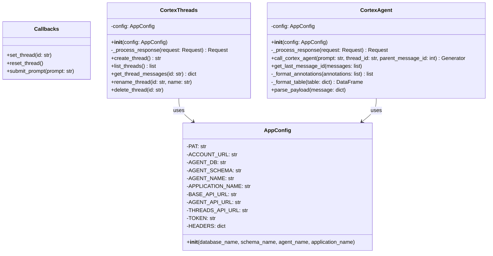
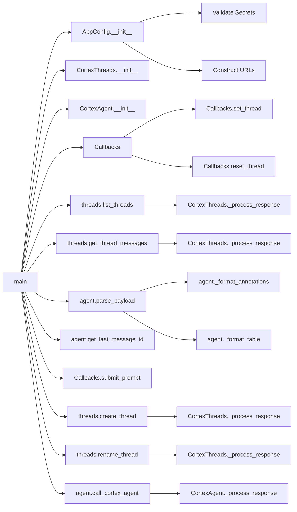
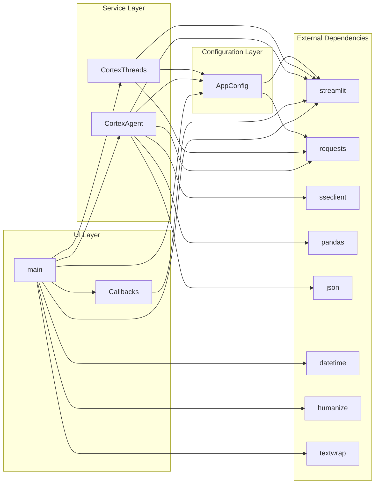
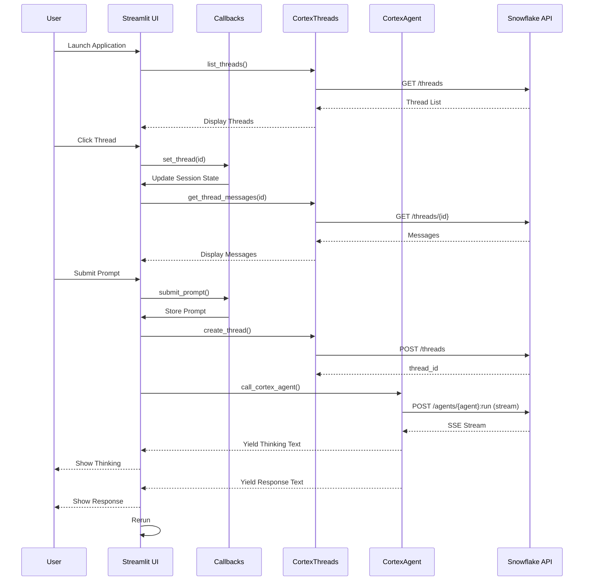

# Technical Documentation

## Overview

This document provides technical documentation for the Streamlit-based Cortex Agent application. The application enables users to interact with Snowflake Cortex Agents through a conversational interface with thread management capabilities.

---

## Library Dependencies

### Core Libraries

- **streamlit**: Web application framework for building the user interface
- **requests**: HTTP library for making API calls to Snowflake Cortex services
- **sseclient**: Server-Sent Events (SSE) client for handling streaming responses
- **os**: Operating system interface for file path operations
- **json**: JSON encoding and decoding for API payloads
- **pandas**: Data manipulation library for displaying tabular results
- **datetime**: Date and time manipulation for timestamp handling
- **humanize**: Human-readable formatting of dates and values

### Type Hints

- **typing.List**: Type hint for list structures
- **typing.Dict**: Type hint for dictionary structures
- **typing.Union**: Type hint for multiple possible types
- **typing.Generator**: Type hint for generator functions

### Text Processing

- **textwrap.shorten**: Utility for truncating text strings with ellipsis

---

## Class Hierarchy



---

## Class Descriptions

### Callbacks

**Purpose**: Manages callback functions for UI interactions and session state management.

**Type**: Class with class methods only (utility class)

**Session State Management**:
- Manages `current_thread` identifier
- Manages `parent_message_id` for conversation context
- Manages `submitted_prompt` for user input

#### Methods

##### `set_thread(cls, id: str)`

**Description**: Sets the current active thread in session state and resets the parent message ID to 0.

**Parameters**:
- `id` (str): The thread identifier to set as the active thread

**Side Effects**:
- Updates `st.session_state["current_thread"]`
- Resets `st.session_state["parent_message_id"]` to 0

---

##### `reset_thread(cls)`

**Description**: Removes the current thread and all related session state variables, effectively starting a fresh session.

**Side Effects**:
- Removes `st.session_state["current_thread"]`
- Removes `st.session_state["parent_message_id"]`
- Removes `st.session_state["submitted_prompt"]`

---

##### `submit_prompt(cls, prompt: str)`

**Description**: Stores the submitted prompt from session state into a dedicated key for processing.

**Parameters**:
- `prompt` (str): The session state key name containing the prompt value

**Side Effects**:
- Updates `st.session_state["submitted_prompt"]` with the value from `st.session_state[prompt]`

---

### AppConfig

**Purpose**: Handles all configurations for the application including secrets validation and API URL setup.

**Responsibilities**:
- Validates required secrets from `.streamlit/secrets.toml`
- Constructs API endpoints for Snowflake Cortex Agent interactions
- Stores authentication credentials and headers

#### Attributes

- `PAT`: Personal Access Token for authentication
- `ACCOUNT_URL`: Snowflake account URL
- `AGENT_DB`: Database name containing the agent
- `AGENT_SCHEMA`: Schema name containing the agent
- `AGENT_NAME`: Name of the Cortex Agent
- `APPLICATION_NAME`: Unique identifier for the application instance
- `BASE_API_URL`: Base URL for Cortex API endpoints
- `AGENT_API_URL`: Full URL for agent execution endpoint
- `THREADS_API_URL`: Full URL for threads management endpoint
- `TOKEN`: Formatted bearer token for authorization
- `HEADERS`: HTTP headers dictionary with content type and authorization

#### Methods

##### `__init__(self, database_name: str, schema_name: str, agent_name: str, application_name: str)`

**Description**: Initializes the application configuration by validating required secrets and constructing API endpoints.

**Parameters**:
- `database_name` (str): Name of the Snowflake database containing the agent
- `schema_name` (str): Name of the schema containing the agent
- `agent_name` (str): Name of the Cortex Agent to interact with
- `application_name` (str): Unique identifier for this application instance

**Validation**:
- Checks for existence of `.streamlit/secrets.toml`
- Validates presence of `pat` and `account_url` in secrets
- Displays error and stops execution if validation fails

**Side Effects**:
- Sets instance attributes for configuration
- Constructs API URLs
- Prepares authorization headers
- May call `st.stop()` if validation fails

---

### CortexThreads

**Purpose**: Manages Cortex Threads API interactions for conversation management.

**Responsibilities**:
- Creates new conversation threads
- Lists all threads for the application
- Retrieves messages from specific threads
- Renames existing threads
- Deletes threads and updates session state accordingly

#### Attributes

- `config` (AppConfig): Application configuration instance

#### Methods

##### `__init__(self, config: AppConfig)`

**Description**: Initializes the CortexThreads manager with the provided application configuration.

**Parameters**:
- `config` (AppConfig): Instance containing API credentials and endpoints

---

##### `_process_response(self, request: requests.Request) -> requests.Request`

**Description**: Processes and validates API responses, handling HTTP errors gracefully by displaying them in the Streamlit UI.

**Parameters**:
- `request` (requests.Request): The HTTP request object to validate

**Returns**:
- `requests.Request`: The validated request object

**Error Handling**:
- Catches `requests.exceptions.HTTPError`
- Displays exception in Streamlit UI using `st.exception()`

---

##### `create_thread(self) -> str`

**Description**: Creates a new conversation thread in Cortex with the application's origin identifier.

**Returns**:
- `str`: The unique thread ID of the newly created thread

**API Call**:
- Method: POST
- Endpoint: `THREADS_API_URL`
- Payload: `{"origin_application": APPLICATION_NAME}`

---

##### `list_threads(self) -> list`

**Description**: Retrieves all threads associated with the current application.

**Returns**:
- `list`: List of thread objects containing metadata (thread_id, thread_name, created_on, updated_on, etc.)

**API Call**:
- Method: GET
- Endpoint: `THREADS_API_URL/?origin_application={APPLICATION_NAME}`

---

##### `get_thread_messages(self, id: str) -> dict`

**Description**: Retrieves all messages and metadata from a specific thread.

**Parameters**:
- `id` (str): The thread ID to retrieve messages from

**Returns**:
- `dict`: Thread data including messages list and metadata

**API Call**:
- Method: GET
- Endpoint: `THREADS_API_URL/{id}`

---

##### `rename_thread(self, id: str, name: str)`

**Description**: Updates the name of an existing thread.

**Parameters**:
- `id` (str): The thread ID to rename
- `name` (str): New name for the thread

**API Call**:
- Method: POST
- Endpoint: `THREADS_API_URL/{id}`
- Payload: `{"thread_name": name}`

---

##### `delete_thread(self, id: str)`

**Description**: Deletes a thread and all its associated messages. Updates session state if the deleted thread is currently active.

**Parameters**:
- `id` (str): The thread ID to delete

**API Call**:
- Method: DELETE
- Endpoint: `THREADS_API_URL/{id}`

**Side Effects**:
- If deleted thread matches `current_thread` in session state:
  - Sets `current_thread` to None
  - Resets `parent_message_id` to 0

---

### CortexAgent

**Purpose**: Manages interactions with Snowflake Cortex Agent for AI-powered conversations.

**Responsibilities**:
- Invokes the Cortex Agent with user prompts
- Handles streaming responses via Server-Sent Events
- Parses and formats various response types (text, annotations, tables, charts)
- Displays formatted responses in the Streamlit UI

#### Attributes

- `config` (AppConfig): Application configuration instance

#### Methods

##### `__init__(self, config: AppConfig)`

**Description**: Initializes the CortexAgent with the provided application configuration.

**Parameters**:
- `config` (AppConfig): Instance containing API credentials and endpoints

---

##### `_process_response(self, request: requests.Request) -> requests.Request`

**Description**: Processes and validates API responses, handling HTTP errors gracefully by displaying them in the Streamlit UI.

**Parameters**:
- `request` (requests.Request): The HTTP request object to validate

**Returns**:
- `requests.Request`: The validated request object

**Error Handling**:
- Catches `requests.exceptions.HTTPError`
- Displays exception in Streamlit UI using `st.exception()`

---

##### `call_cortex_agent(self, prompt: str, thread_id: str, parent_message_id: int = 0) -> Union[Generator, int]`

**Description**: Sends a prompt to the Cortex Agent and streams the response using Server-Sent Events. Yields both thinking process and final text responses.

**Parameters**:
- `prompt` (str): The user's question or command
- `thread_id` (str): The conversation thread ID
- `parent_message_id` (int): ID of the parent message in the thread (default: 0)

**Yields**:
- `tuple`: (is_text_response, content) where:
  - `is_text_response` (bool): True for final text response, False for thinking process
  - `content` (str): The text content or formatted annotation

**API Call**:
- Method: POST
- Endpoint: `AGENT_API_URL`
- Payload: Contains messages, stream flag, thread_id, and parent_message_id
- Stream: True

**Event Types Handled**:
- `response.thinking.delta`: Thinking process text
- `response.text.delta`: Final response text
- `response.text.annotation`: Document annotations with formatted links

---

##### `get_last_message_id(self, messages: list)`

**Description**: Extracts the message ID from the second-to-last message in the thread and stores it in session state for conversation continuity.

**Parameters**:
- `messages` (dict): Dictionary containing the messages list from a thread

**Side Effects**:
- Updates `st.session_state["parent_message_id"]`

---

##### `_format_annotations(self, annotations: list) -> list`

**Description**: Formats annotations into a structured list with numbered references and document URLs.

**Parameters**:
- `annotations` (list): List of annotation objects from the agent response

**Returns**:
- `list`: List of dictionaries containing:
  - `number` (int): Sequential annotation number
  - `url` (str): Document ID/URL
  - `position` (int): Character position in text

---

##### `_format_table(self, table: dict) -> pd.DataFrame`

**Description**: Converts table response data from the agent into a pandas DataFrame with proper column names.

**Parameters**:
- `table` (dict): Table object containing result_set and metadata

**Returns**:
- `pd.DataFrame`: Formatted table with data and column names

**Data Extraction**:
- Extracts data from `table["result_set"]["data"]`
- Extracts column names from `table["result_set"]["resultSetMetaData"]["rowType"]`

---

##### `parse_payload(self, message: dict)`

**Description**: Parses a message payload and displays it in the Streamlit UI using appropriate components based on content type.

**Parameters**:
- `message` (dict): Message dictionary containing role and message_payload

**Content Types Handled**:
- **text**: Rendered as markdown, with inline annotations if present
- **annotations**: Formatted as clickable links with numbers
- **table**: Displayed as interactive DataFrame
- **chart**: Rendered as Vega-Lite chart

**UI Components Used**:
- `st.chat_message()`: For role-based message display
- `st.write()`: For user messages
- `st.markdown()`: For assistant text responses
- `st.dataframe()`: For tabular data
- `st.vega_lite_chart()`: For chart visualizations

---

## Function Descriptions

### main()

**Description**: Main application entry point that orchestrates the Streamlit application flow.

**Responsibilities**:
- Initializes AppConfig with agent configuration
- Creates CortexThreads and CortexAgent instances
- Renders the UI including sidebar thread list and main chat interface
- Handles thread selection and creation
- Manages chat input and response streaming
- Displays conversation history

**UI Components**:
- New Thread button in header
- Sidebar with recent chats grouped by time (Today, Yesterday, Older)
- Chat input field
- Chat message display with streaming responses
- Status indicator for thinking process

**Flow**:
1. Initialize configuration and service instances
2. Render sidebar with existing threads
3. Load and display selected thread messages
4. Handle new user input
5. Create thread if needed
6. Stream agent response
7. Display thinking process and final response
8. Rerun to refresh state

---

## Function Hierarchy



---

## Function Dependencies



---

## Component Interaction Flow



---

## Session State Variables

| Variable | Type | Purpose |
|----------|------|---------|
| `current_thread` | str \| None | Stores the ID of the currently active conversation thread |
| `parent_message_id` | int | Tracks the parent message ID for maintaining conversation context |
| `submitted_prompt` | str \| None | Temporarily stores the user's submitted prompt for processing |
| `input_prompt` | str | Managed by st.chat_input widget for capturing user input |

---

## API Endpoints

### Threads API

| Endpoint | Method | Purpose |
|----------|--------|---------|
| `/api/v2/cortex/threads` | POST | Create new thread |
| `/api/v2/cortex/threads?origin_application={app}` | GET | List all threads for application |
| `/api/v2/cortex/threads/{id}` | GET | Get thread messages |
| `/api/v2/cortex/threads/{id}` | POST | Update thread (rename) |
| `/api/v2/cortex/threads/{id}` | DELETE | Delete thread |

### Agent API

| Endpoint | Method | Purpose |
|----------|--------|---------|
| `/api/v2/databases/{db}/schemas/{schema}/agents/{agent}:run` | POST | Execute agent with prompt (streaming) |

---

## Configuration Requirements

### Secrets File (.streamlit/secrets.toml)

Required keys:
- `pat`: Personal Access Token for Snowflake authentication
- `account_url`: Base URL for Snowflake account

### Agent Configuration

Configured in `main()` function:
- `database_name`: Database containing the agent
- `schema_name`: Schema containing the agent
- `agent_name`: Name of the agent to use
- `application_name`: Unique application identifier for thread management

---

## Data Structures

### Thread Object

```
{
    "thread_id": str,
    "thread_name": str,
    "created_on": int (timestamp in milliseconds),
    "updated_on": int (timestamp in milliseconds),
    "origin_application": str
}
```

### Message Object

```
{
    "message_id": int,
    "role": str ("user" | "assistant"),
    "message_payload": str (JSON string),
    "created_on": int (timestamp)
}
```

### Message Payload Content Types

- **text**: `{"type": "text", "text": str, "annotations": list}`
- **table**: `{"type": "table", "table": dict}`
- **chart**: `{"type": "chart", "chart": dict}`
- **annotations**: `{"type": "annotations", ...}`

---

## Event Types (SSE)

| Event Type | Description | Data Structure |
|------------|-------------|----------------|
| `response.thinking.delta` | Streaming thinking process | `{"text": str}` |
| `response.text.delta` | Streaming response text | `{"text": str}` |
| `response.text.annotation` | Document annotation reference | `{"annotation": dict, "annotation_index": int}` |

---

## UI Layout Structure

```
Application Root
├── Header
│   └── New Thread Button
├── Sidebar
│   └── Recent Chats
│       ├── Today
│       ├── Yesterday
│       └── Older
│           └── Thread Buttons (with delete)
└── Main Content
    ├── Chat Messages (historical)
    ├── Active Streaming
    │   ├── Thinking Status
    │   └── Response Content
    └── Chat Input
```

